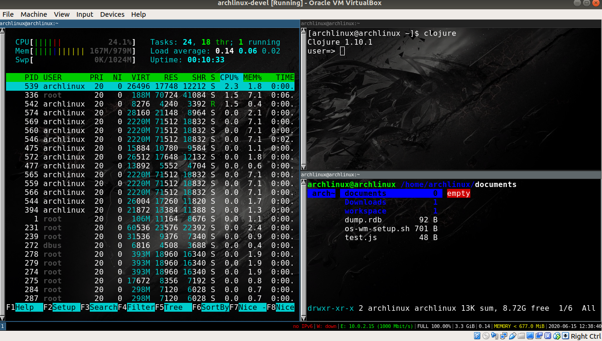

## Bash script to (partially) automate the installing Arch linux distro process #

This install script is set up expecting a machine with at least **20GB of disk storage (and also 512M RAM + 2GHz CPU)**. This disk will be divided in a **logical partition***, as follows:

  ### 1. /boot/efi with +512M (UEFI boot mode, thus)
  ### 2. / with +9GB
  ### 3. swap with +1GB
  ### 4. /home with the rest (~ +9,5GB)
  
1. Run install.sh script, then post-install.sh, and finally os-wm-setup script
2. To get each script so that you can run locally during the install process, download it with **wget-c <raw github script file>**
3. First then download and run install.sh
4. After you reach chmod-arch, you should download and run post-install.sh
5. After post-install finishes, you should exit and reboot to enter with your new OS user
6. Then you download and run os-wm-setup script to finish the process

The whole install setup process results in the following environment:

